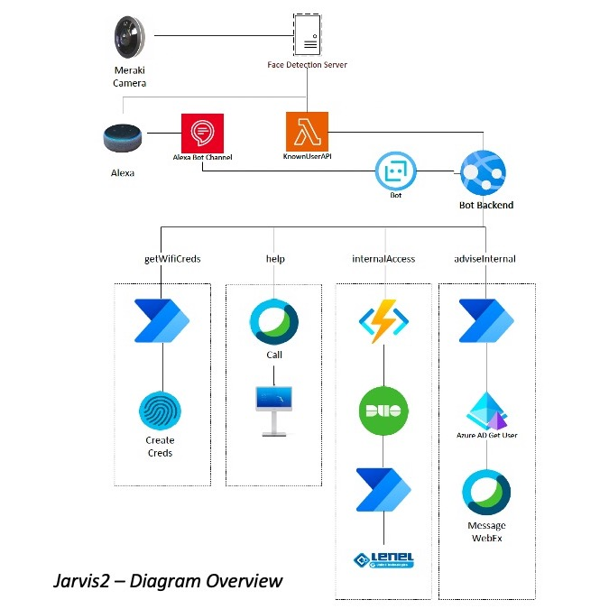

# Jarvis2 - Cisco Hackathon Trusted Workplace 2021

## Inspiration

The way we work has changed dramatically. The place we use as a work station is no longer static, but “hybrid”. New demands and challenges arise with this new model of workforce movement. The technology to support this work in the hybrid format is also rapidly evolving to keep everyone connected. Knowing this, we are thinking not just about connections, but about the quality of those connections.

This new working model is generating new frontiers, one of them the “physical office”, and challenges for C-Levels.

In the same way that we had to adapt to this new scenario, imposed by the pandemic caused by COVID-19, the network infrastructures and physical spaces had to do the same. Thanks to Cisco solutions, combined with customizations made through APIs, this adaptability was possible to be achieved, enabling a balance between security, collaboration, sustainability and productivity. This space should also create a significant impact on your users' experience.

To create this impact on the user experience, we implemented the “Zero Friction” concept. This concept aims to create a fluid experience for users as they cross the boundary of a physical office having access to the various resources of the space with as little interaction, clicks on a screen, as possible. At the same time, information and user identification are captured and reports and Dashboards are generated that facilitate C-Levels decision making.

## What it does
The first frontier of access to a physical office is the receptionist. Our work focused on creating a virtual receptionist that connects to and uses multiple Cisco solutions to provide users with quick and easy access to a range of office resources. In the current version for this Hackathon we have implemented the following features:

### *User Identification*

Through Meraki's Smart Cameras, we capture the image of the user who lights up the office. Using computer vision algorithms, we extract the user's identification through facial biometrics and categorize him as a known user (through the catalog of faces registered for the solution) or an unknown user. As soon as the user is identified, a notification is made via API and the identification information is made available for consumption by the voice assistance system.

### *Voice assistant*

For voice interaction, we use Alexa. Upon receiving an API call informing that a person has been identified, the assistant initiates an interaction with the user, welcoming:

"Hello, welcome to NTT! Ahh you again. You look good today. How can I help you?"

The following features were implemented for this Hackathon:

### *Release of physical access*

The user may request via Voice for the opening of the company's doors. For this functionality we have integrated the Cisco DUO two-factor authentication solution. Using the APIs we send a confirmation request to the user that, when confirmed, the company's doors open.

### *Meeting Assistant*

If the user informs that they have a meeting, the assistant will ask who they want to meet. When identifying a user by name through a search in the company's AD, we perform the Cisco Webex integration to send a notification via chat to the employee responsible for the meeting that his guest is waiting at the reception.

### *Guest Wireless Access*

Using the company's network infrastructure (Switches and Wireless Catalyst), we created an integration through APIs with Cisco ISE with the objective of creating the credentials of a guest user for a guest and making them available through e-mail. -mail and QR-Code. Thus, the visiting user, upon arriving at the company and being identified by the system, will be able to request their access to the network in a totally "no touch" way.

### *Support* 

If the user has difficulty interacting with the system, he can ask for help from an operator. In this scenario, we created an API integration with the Cisco telephone system using an MX-200 as a video call device. When help is requested, the system automatically closes a video call with an operator who will be able to assist and welcome the visitor at NTT's premises.

## How we built it
The user recognition and identification system was developed using Python programming language. We created a routine to capture images through the camera's RTSP stream. Using the functionality of the OpenCV library, we perform a search for faces and cut the face for processing. The face is coded and a search is performed on a database of coded faces. If found, the user is known to be known. If not, the user is given as unknown. When a user is recognized by the system, two API calls are sent - One to Al's system

## Diagram

## Files Structure
At "findfaces" folder you will give access to Python code that identify and recognize users based on a local database. Please refer to the README.md file in that folder.

At "voiceassitant" folder you will give access to the files created to the Alexa Voice assistant and voice interaction functions.

At "wifiqrcode" folder yoy will give access to the files that was used to generate a QR Code to easily provides user wifi access.

## Contributors
<table>
  <tr>
     <td align="center">
      <a href="#">
         
        
          <b>Ricardo Soares</b>
        
      </a>
    </td>
    <td align="center">
      <a href="#">
         
        
          <b>Ewertom Pinheiro</b>
        
      </a>
    </td>
    <td align="center">
      <a href="#">
         
        
          <b>Vitor Villela</b>
        
      </a>
    </td>
    <td align="center">
      <a href="#">
         
        
          <b>Leandro Pinto</b>
        
      </a>
    </td>
    <td align="center">
      <a href="#">
         
        
          <b>Marcelo Oliveira</b>
        
      </a>
    </td>
  </tr>
</table>

## Contact
Created by: Ricardo Soares

Personal e-mail: soares.ricardo@gmail.com

Corporate e-mail: ricardo.a.soares@global.ntt
